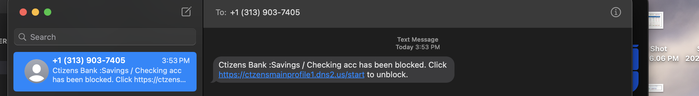
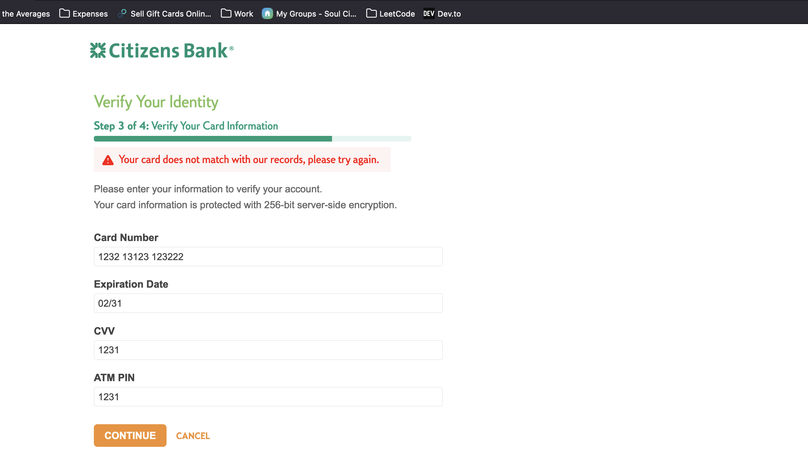
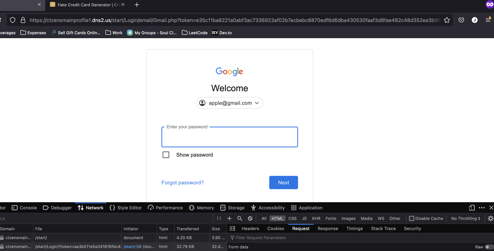

This bot scams a fake phishing link with requests in an infinite loop.
Use only for Educational Purposes :)

# Why?
It started off with this:
I don't use Citzens Bank in any capacity...

## Fake Citzens Bank 

## Fake Google Login 

# To-Do's:

- add support for proxies 

- add more fake websites

